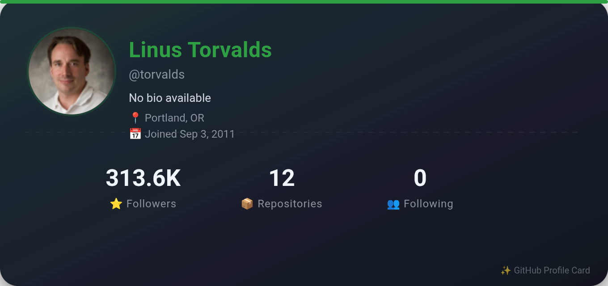
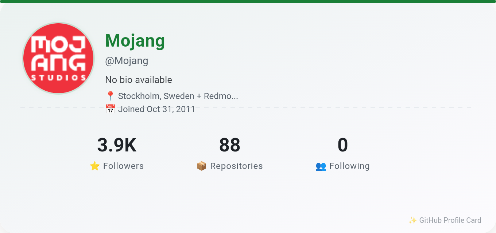

# 🃏 SVG Profile Card Generator

A simple, modern GitHub profile card generator that creates beautiful SVG cards with your GitHub stats.

## ✨ Features

- 🎨 **3 Themes**: Default, Light, and Special (gold accent)
- 📊 **Rich Profile Data**: Followers, Repositories, Following, Bio, Location, Join Date
- 🖼️ **PNG Export**: Recommended for maximum compatibility
- 💾 **SVG Export**: For vector graphics needs
- ⚡ **Smart Caching**: Reduces API calls with 10-minute cache
- 🛡️ **Rate Limit Protection**: 3-second cooldown between requests
- 👑 **Creator Badge**: Special recognition for `dryfish09`

## 🚀 How to Use

1. **Enter** your GitHub username
2. **Click** "Generate Card"
3. **Choose** a theme (Default, Light, or Special)
4. **Download** as PNG (recommended) or SVG

## 📸 Examples

### Torvalds (Default Style)


### Mojang (Light Mode)


### dryfish09 (Special Style)


## 📝 Important Notes

> [!NOTE]
> **GitHub Avatar in SVG**: Due to CORS restrictions and external resource blocking, the avatar image in SVG format may not display correctly in some SVG renderers (including GitHub's built-in renderer). For best results, **download as PNG** instead.

## 🛠️ Technical Details

- **Framework**: Vanilla JavaScript (no dependencies)
- **Rendering**: SVG with Canvas fallback for PNG export
- **Cache**: localStorage (with automatic RAM fallback)
- **API**: GitHub Public API (rate limited to 60 req/hour)
- **Themes**: CSS custom properties for seamless switching

## 🎯 Quick Start

```bash
# Clone the repository
git clone https://github.com/dryfish09/card-svg-gen.git

# Open index.html in your browser
open index.html
```

Or visit the live demo: [dryfish09.github.io/card-svg-gen](https://dryfish09.github.io/card-svg-gen/)

## 📦 Deployment

### GitHub Pages
```bash
# Push to GitHub Pages branch
git push origin main
```

### Vercel / Netlify
```bash
# Deploy the folder directly
# No build steps required - it's pure HTML/CSS/JS
```

## 🔧 Customization

### Change the Special User
```javascript
// In index.html, line ~280
const SPECIAL_USER = 'your-username';
const SPECIAL_NOTE = 'Your custom note';
```

### Adjust Cache Duration
```javascript
// In index.html, line ~270
const CACHE_TTL = 600; // seconds (10 minutes)
```

### Modify Colors
```javascript
// In index.html, line ~290-310
const COLORS = {
    accent: '#58a6ff',    // Primary color
    gold: '#f0883e',      // Special theme color
    // ... etc
};
```

## 📄 License

MPL © [dryfish09](https://github.com/dryfish09)

## 🙏 Acknowledgments

- Data provided by [GitHub API](https://api.github.com)
- Inspired by [shields.io](https://shields.io)
